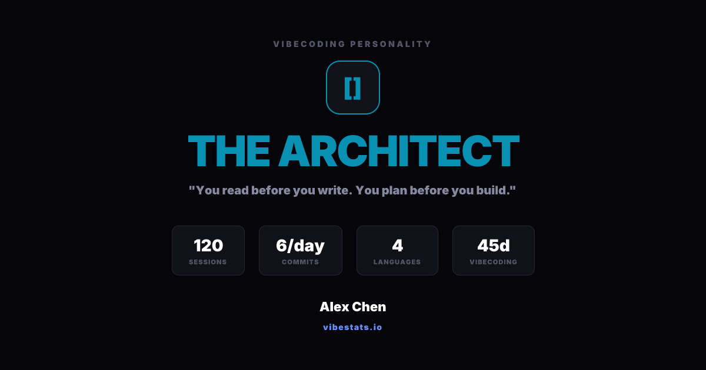
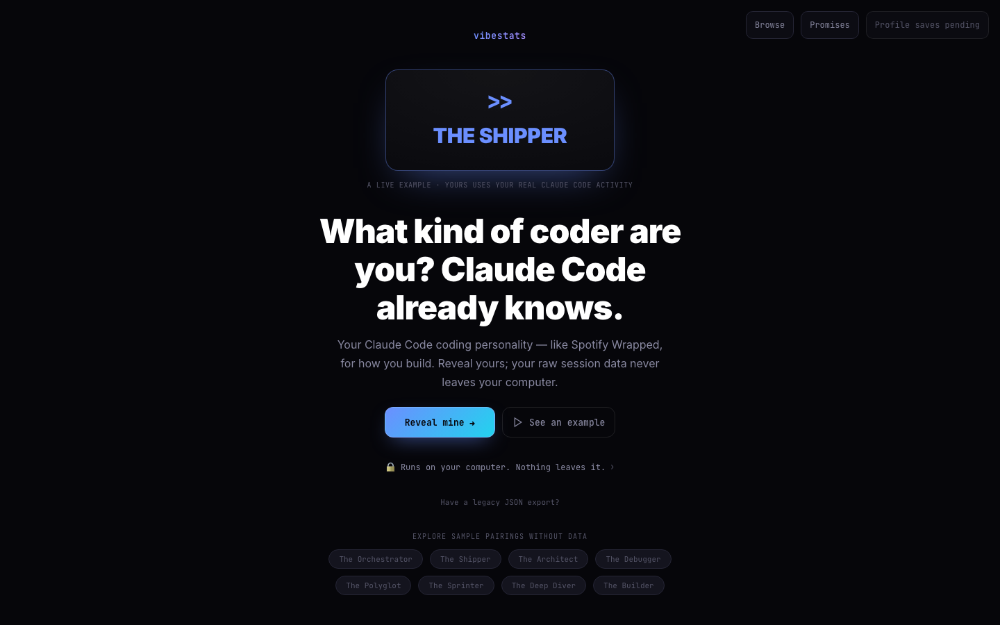
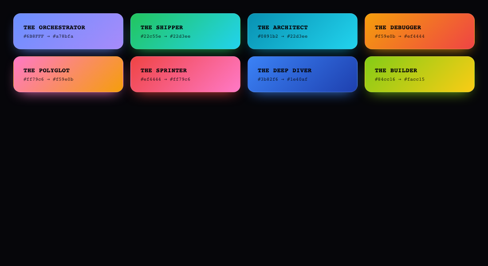
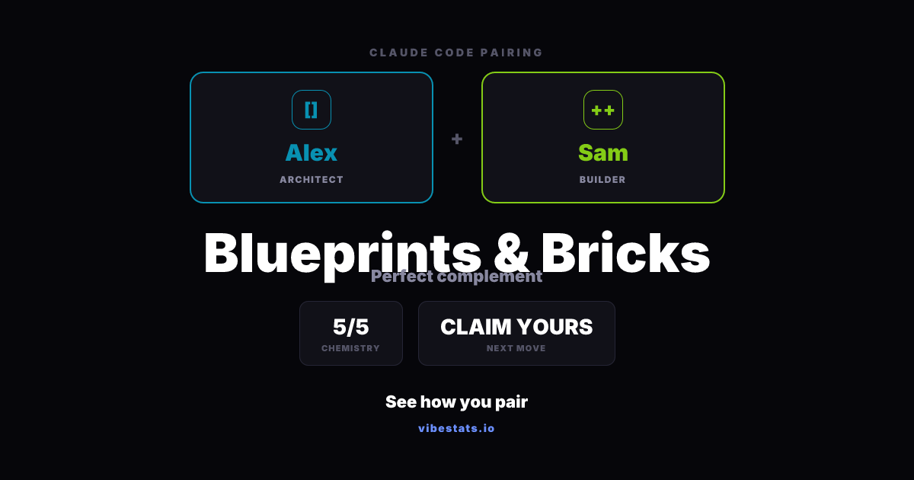

# You already took the test by coding
### How I built a coding-personality reveal for Claude Code — without ever seeing your code.

*The reveal: an archetype derived from how you actually build — not a quiz you fill out.*

Every developer tool wants to show you a dashboard. Commits this week, lines changed, a streak you'll feel bad about breaking. I've never found those interesting. They measure volume, not character — *how much* you did, never *who you are* when you build.

But somewhere in Claude Code's `/insights` there's something better hiding: a fingerprint. Not how much you code — how you *move*. Whether you read before you write or write before you read. Whether you orchestrate five agents at once or disappear into one problem for six hours. Whether you ship at 2am or plan for a week first. That's not a statistic. That's a personality.

So vibestats started as a question: what if your tools gave that back to you — as identity, not analytics?

The model in my head was Spotify Wrapped. Once a year Spotify hands you a story about yourself you didn't know you were writing, and you can't help but share it. But Wrapped has an unfair advantage: Spotify already has all your data, on their servers. The whole thing is one tap.

I couldn't do that. And more importantly, I didn't want to.

The most intimate data a developer has is *how they think* — their prompts, their dead ends, the projects they're not ready to talk about. The fastest way to build this would have been "upload your insights file." It would also have been a betrayal. So the first decision, before a single archetype existed, was the one that defined everything after it: **your raw data never leaves your machine.** vibestats derives your result locally and only ever sends a handful of public-safe, bucketed fields — and only if you choose to. We never see the JSON.

*Reveal, don't upload. The result is derived on your own machine; the raw `/insights` data never leaves it.*

That one constraint rippled into the whole product. It's why there's a small, slightly awkward terminal step instead of a magic button — the derivation has to happen where your data lives, on your computer. For a while I tried to hide that friction. Eventually I decided to be honest about it instead: *reveal, don't upload.* People trust the awkward-but-honest version more than the frictionless-but-creepy one.

The result is eight archetypes — Orchestrator, Shipper, Architect, Debugger, Polyglot, Sprinter, Deep Diver, Builder — each derived from observable behavior, not a quiz you fill out. That's the part I find genuinely interesting: it's a personality test you can't game. You can lie to Myers-Briggs. You can't lie to your own commit history.

*The eight archetypes. Each gets its own glyph and color territory — a visual language people can recognize at a glance and adopt as shorthand.*

But the archetype was never the point. The point was the next question.

The viral instinct for a product like this is "look at me." I think the better one is "who would you build with?" An Architect and a Builder are the rarest, most productive pairing — one designs the system, the other makes it real. A Deep Diver and a Shipper are depth meeting velocity. The most valuable thing vibestats can say isn't *what you are* — it's *who you'd be dangerous with.* That's a matchmaking signal no résumé carries: connection based on how you actually build, not how you describe yourself.

*Not "look at me" — "who would you build with?" Architect × Builder renders as "Blueprints & Bricks," a perfect complement.*

A surprising amount of the work was deciding what *not* to build. No raw-data upload. No ninth archetype. No swipe-matching, no DMs, no points and tokens. Every one of those would have made the demo flashier and the thing itself worse. The discipline was keeping it a clean mirror and an honest connection — and refusing the features that turn a product into another engagement trap.

It's opinionated and imperfect. Eight types will never capture a person; the scoring is a point of view, not a science. But that's also why it works as a thing you send to a friend — it's specific enough to argue with. "There's no way I'm a Sprinter" is exactly the reaction that makes someone go reveal their own.

You already took the test. You took it every time you opened Claude Code and started building. vibestats just reads the result back to you — and then asks who you'd build with next.

---

*Reveal yours at [vibestats.io](https://vibestats.io). Runs on your computer; your raw data stays there.*
